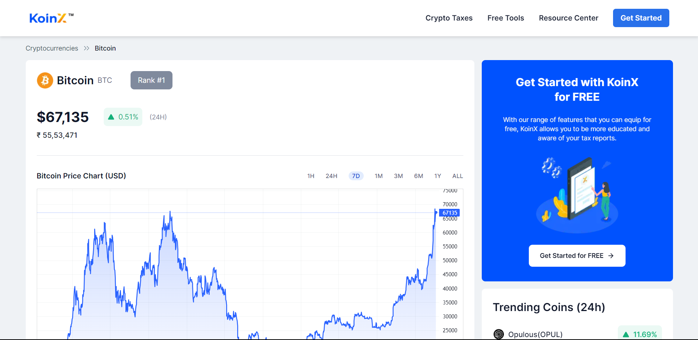

# KoinX - Assignment

Welcome to KoinX – Your Gateway to the Future of Crypto!

This is the assignment for KoinX - Frontend Intern. The Figma design which have been implemented is here in [Figma Design](https://www.figma.com/file/VRj5MqVPoQdj5N7AwmYc98?embed_host=notion&kind=file&mode=design&node-id=0-1&t=x8gdUiF5gA3sjRd3-0&type=design&viewer=1).

**Live Demo:** [https://samrat-koinx-assignment.vercel.app](https://samrat-koinx-assignment.vercel.app)

The Mandatory Tasks have been completed as follow:

- All components in the given Figma design have been implemented.
- Coingecko's `/simple/price` API has been used to fetch the price of bitcoin in USD and INR.
- TradingView's embed chart has been used to implement the chart component .
- Coingecko’s `/search/trending` API has been used to fetch the list of top 3 trending coins to be displayed in the “Trending Coins (24h)” component on the right.
- Horizontally scrollable carousel has been impemented for "You May Also Like" and "Trending Coins" section.
- The UI has been built responsive according to the Figma design.

The Optional Tasks have been implemented as follows:

- The token has been shown dynamically using the URL params to show details of different valid Coins.
- The `/coins/{id}` API from Coingecko has been used to fetch relevant data for dynamic tokens.

Some additional features have been implemented as follow:

- Simple Error and Loading pages for handling errors and loading conditions.
- Dynamic price tag components to properly display up and down prices, i.e, green tag with up arrow for positive price change and red tag with down arrow for negative change.
- Dynamic data for Fundamental section from relevant API for respective coins.



### Built With

- [React](https://reactjs.org/)
- [NextJs](https://nextjs.org/)
- [Typescript](https://www.typescriptlang.org/)
- [Tailwind CSS](https://tailwindcss.com/)

## Getting Started

### Installation

_Follow the following steps to install and setup._

1. Clone the repo
   ```sh
   git clone https://github.com/Samrat-14/koinx-assignment.git
   ```
2. Once inside the cloned repo, get started with installing the node modules.
   ```sh
   npm install
   ```
3. Start the server.
   ```sh
   npm run dev
   ```
4. After the installments are over and the server is running, you can get started with the project.

## License

Distributed under the MIT License. See `LICENSE` for more information.
